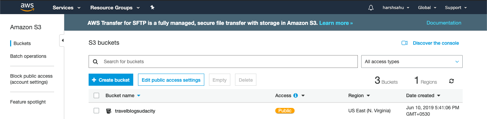
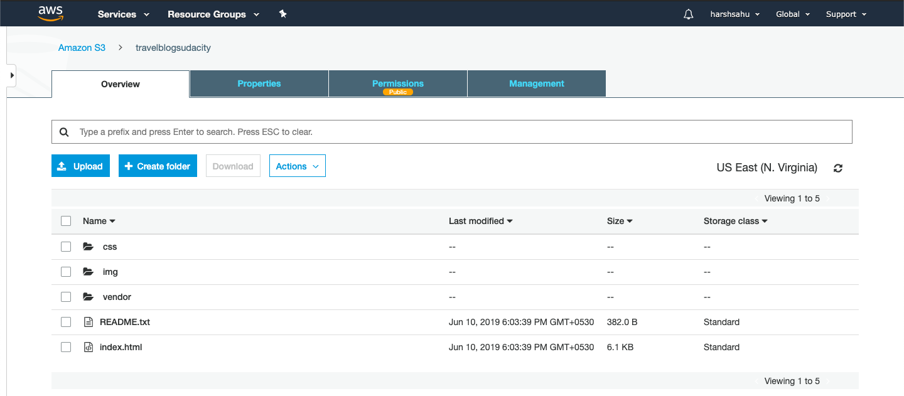
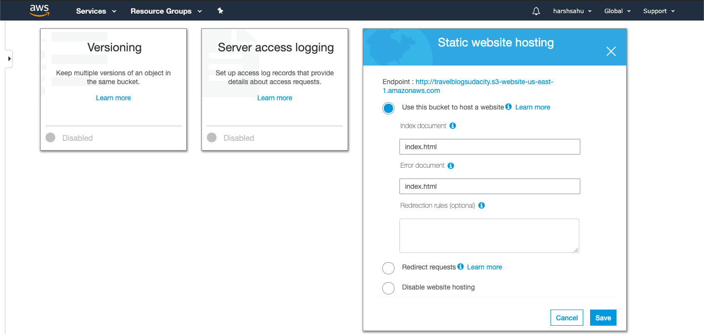
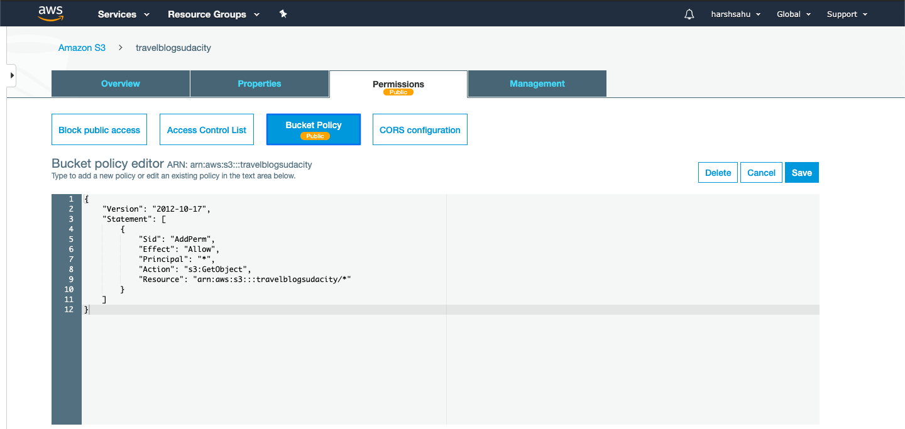
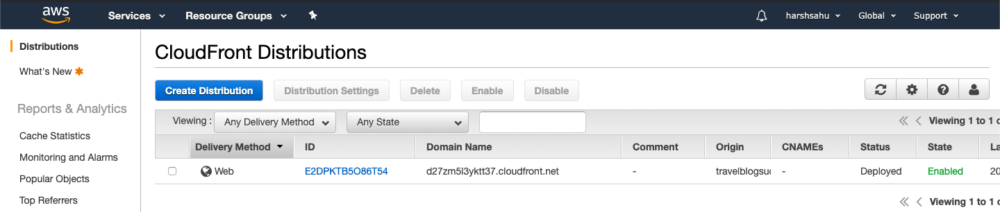
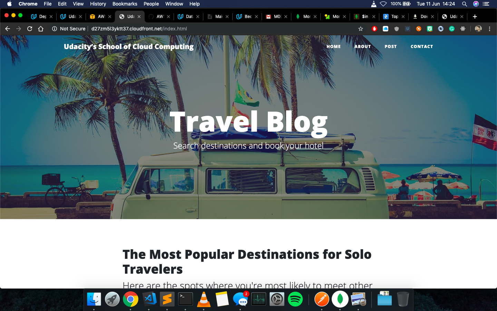

# AWS Static WebSite Deployment

This project is a part of [Udacity's Cloud Developer Nanodegree program](https://www.udacity.com/course/cloud-developer-nanodegree--nd9990).

## Project Overview

The cloud is perfect for hosting static websites that only include HTML, CSS, and JavaScript files that require no server-side processing. In this project, I've deployed a static website to AWS. I created a S3 bucket, configure the bucket for website hosting, and secure it using IAM policies. I uploaded the website files to your bucket and speed up content delivery using AWS’s content distribution network service, CloudFront. Lastly, I was able to access my website in a browser using the unique S3 endpoint.

## CloudFrount endpoint URL

http://d27zm5l3yktt37.cloudfront.net/index.html

## Prerequisites

* AWS Account
* Website code

## Topics Covered

* S3 bucket creation

* S3 bucket file upload

* S3 bucket setup for static website hosting

* S3 bucket configuration

* Website distribution via CloudFront

* Access website via web browser (Checkout the URL in screentshot).

## License
[MIT](https://choosealicense.com/licenses/mit/)

## Issues
Contact me on [Twitter](https://twitter.com/harshsahu97).

